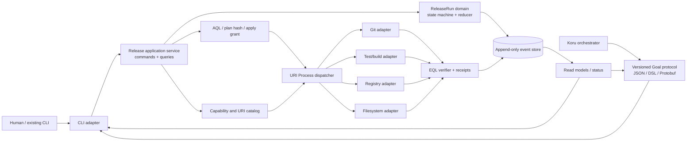
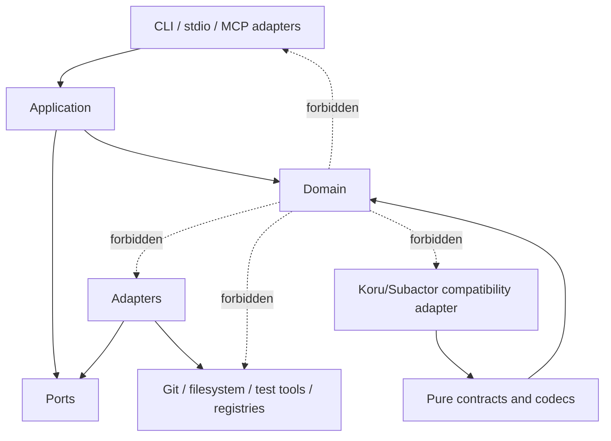

# Goal target architecture

This document visualizes the architecture governed by
`GOAL_KORU_SUBACTOR_REFACTORING_PLAN.md`.

## Dependency rules

The application depends on port interfaces, while concrete adapters implement
those ports. Koru/Subactor integration sees public protocol contracts only.
