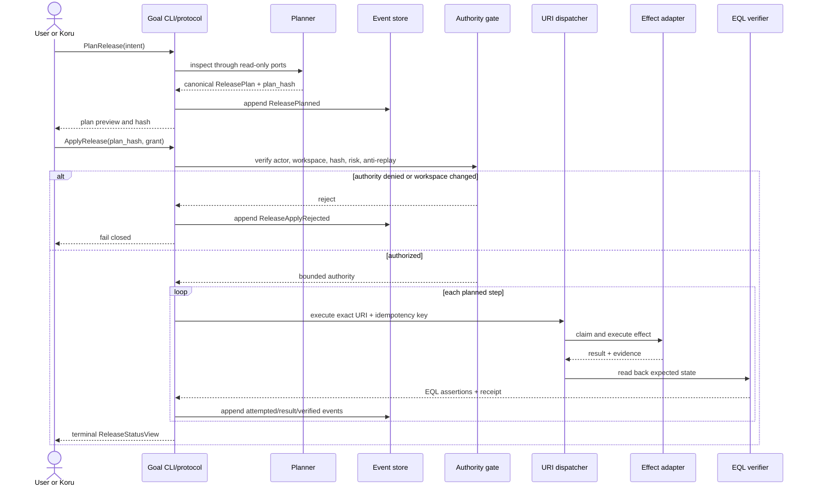
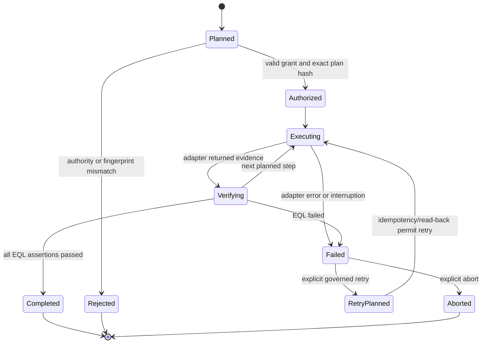

# Goal release logic flow

## Plan and apply

## Failure, retry and replay

Replay follows only `event stream -> reducer -> projection`. It has no edge to
the URI dispatcher or effect adapters. A repair or compensation requires a new
command, plan and authority decision.
